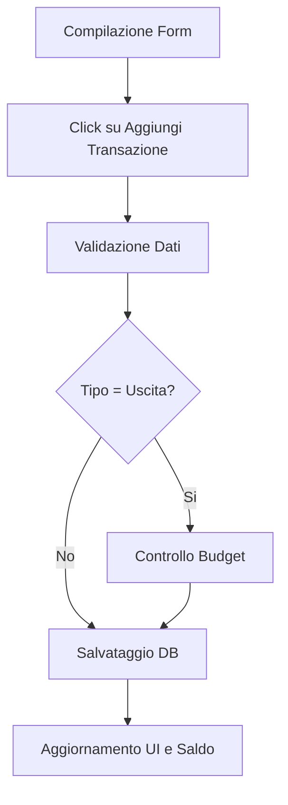
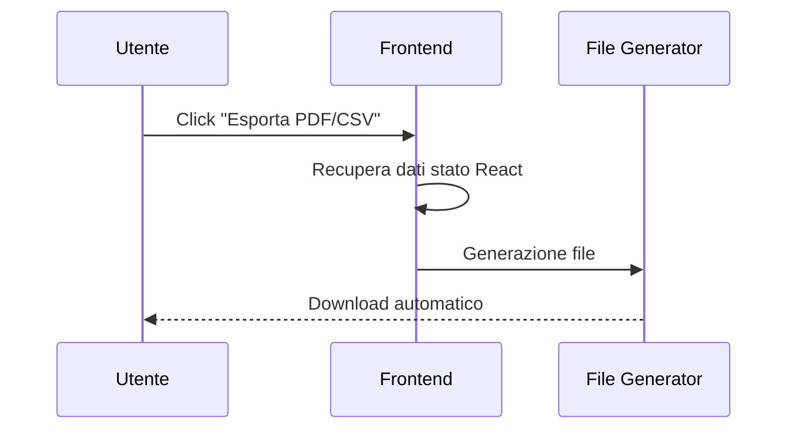
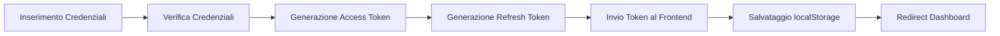

# 📌 Use Case Documentation

## 1️⃣ Inserimento Transazione

> Questo è il cuore operativo dell'app. Include logicamente il controllo del budget.

---

### 👤 Attore Primario
**Utente**

### ✅ Pre-condizioni
- L'utente è autenticato
- L'utente si trova nella pagina `Transactions`

---

## 🔄 Flusso Principale (Happy Path)



### 📝 Passaggi

1. L'utente compila il form inserendo:
   - Titolo
   - Importo
   - Categoria
   - Tipo (`Entrata/Uscita`)

2. L'utente clicca su **"Aggiungi Transazione"**

3. Il sistema valida i dati  
   *(backend: `transactionController.js`)*

4. **[Inclusione: Controllo Budget]**
   - Se il tipo è `"Uscita"`
   - Il sistema interroga:

```http
POST /api/budget/check-will-exceed
```

5. Il sistema salva la transazione nel database **MySQL**

6. Il sistema aggiorna:
   - Lista transazioni
   - Saldo totale nella UI

---

## ⚠️ Flussi Alternativi

### A1 — Budget Superato

Se il controllo al punto 4 rileva che l'uscita supera il budget di categoria:

```js
window.confirm()
```

Il sistema mostra un warning chiedendo se procedere comunque.

---

### 📌 Post-condizioni

- La transazione è registrata
- Il saldo è aggiornato

---

# 2️⃣ Esportazione Report

> Questo scenario estende la gestione delle transazioni.

---

### 👤 Attore Primario
**Utente**

### ✅ Pre-condizioni
- Esistono transazioni caricate nella tabella

---

## 🔄 Flusso Principale



### 📝 Passaggi

1. L'utente visualizza la tabella delle transazioni

2. L'utente clicca sul pulsante:
   - `Esporta PDF`
   - oppure `CSV`

3. Il sistema (`ExportButtons.jsx`) cattura i dati attualmente presenti nello stato React

4. Il sistema genera il file:
   - usando `jsPDF`
   - oppure logica `CSV`

5. Il file viene scaricato automaticamente nel browser dell'utente

---

## 🛠️ Note Tecniche

```txt
L'esportazione avviene lato client
senza chiamate API dedicate
al rendering del file.
```

---

# 3️⃣ Login e Inizializzazione Sessione

> Fondamentale per il multi-tenancy.

---

### 👤 Attore Primario
**Visitatore**

### ✅ Pre-condizioni
- Il visitatore possiede già un account creato

---

## 🔄 Flusso Principale



### 📝 Passaggi

1. Il visitatore inserisce:
   - Email
   - Password

2. Il sistema (`authController.js`) verifica:
   - credenziali
   - `tenant_id` associato all'utente

3. Il sistema genera:
   - `Access Token` *(breve durata)*
   - `Refresh Token` *(lunga durata)*

4. Il sistema invia i token al frontend

5. Il frontend:
   - salva i token nel `localStorage`
   - reindirizza l'utente alla `Dashboard`

---

## ❌ Flussi di Errore

### E1 — Credenziali Errate

Il sistema restituisce:

```http
401 Unauthorized
```

Il frontend mostra un messaggio di allerta.

---

## 📌 Post-condizioni

L'utente è autenticato e tutte le successive chiamate API includeranno:

```http
Authorization: Bearer <token>
```
